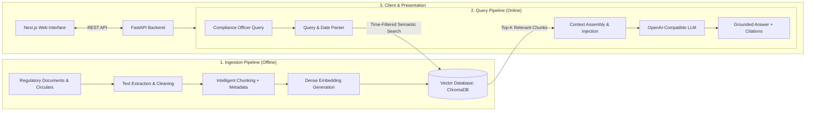

# ChronoLex

## Tagline

> **Find the rule. Know when it applied. See why.**

---

## Problem Statement

A large bank maintains thousands of compliance circulars, regulatory advisories (e.g., RBI, SEC, Basel Committee), internal audit directives, and policy updates. When evaluating a specific transaction—such as a cross-border remittance, credit authorization, or high-value correspondent account operation—risk and compliance officers face a significant bottleneck:

- **Historical Contradictions & Amendments**: Regulations are frequently amended, clarified, or superseded over time. A circular issued in 2021 might be modified by an addendum in 2023 and partially revoked in 2024.
- **Time Inconsistency**: Compliance officers cannot simply ask *"What is the rule?"*—they must determine *"What rule was in force on the exact date of this transaction?"*
- **Audit Risk & Hallucination**: Generic AI tools or manual skim-reading can introduce hallucinations or miss critical carve-outs. Audits demand line-item traceability back to the authoritative text, circular paragraph, and effective date.

Compliance officers currently spend hours manually reconciling conflicting historical PDFs, exposing the institution to compliance breaches, regulatory fines, and operational delays.

---

## Proposed Solution

**ChronoLex** is a time-aware, source-grounded Retrieval-Augmented Generation (RAG) assistant tailored specifically for banking compliance and risk officers.

Instead of relying on general LLM memory, ChronoLex anchors every answer in the organization's verified document repository. By indexing regulatory documents alongside temporal metadata (`effective_from`, `effective_to`, `supersedes_id`, `issuing_authority`), ChronoLex performs date-scoped semantic retrieval to identify the exact rule governing any transaction date, synthesizing clear explanations with verifiable line-by-line citations and explicit refusal guardrails when evidence is insufficient.

---

## Core Idea

The end-to-end information flow follows a rigorous RAG pipeline:

```
Regulatory Documents (PDFs, Circulars, Directives)
   │
   ▼
Text Extraction (Layout-aware document parsing)
   │
   ▼
Cleaning & Normalization (Header/footer stripping, boilerplate removal)
   │
   ▼
Intelligent Chunking (Hierarchical section & clause boundary splitting)
   │
   ▼
Metadata Enrichment (Source, Circular No., Effective Date, Authority, Status)
   │
   ▼
Embedding Generation (Dense vector representations via embedding model)
   │
   ▼
Vector Database (ChromaDB collection with payload metadata index)
   │
   ▼
Time-Aware Retrieval (Semantic similarity + Temporal date-range filtering)
   │
   ▼
Context Injection (Assembled prompt with strictly bounded evidence)
   │
   ▼
LLM Generation (Deterministic reasoning instructions)
   │
   ▼
Grounded Answer + Citations (Exact circular, section, paragraph, and date)
```

---

## Key Features

| Feature | Status | Description |
|---|---|---|
| **Regulatory Document Ingestion** | ⏳ *Planned (Week 2)* | Automated ingestion of multi-page PDF circulars and regulatory directives. |
| **PDF Text Extraction & Cleaning** | ⏳ *Planned (Week 2)* | Robust parsing preserving tables, section headers, and removing recurrent noise. |
| **Intelligent Chunking** | ⏳ *Planned (Week 2)* | Clause-aware token chunking with sliding overlap to maintain regulatory context. |
| **Metadata & Provenance Tracking** | ⏳ *Planned (Week 2)* | Attribution tagging for circular number, issuing authority, and effective date ranges. |
| **Embedding Generation** | ⏳ *Planned (Week 3)* | Batch vector generation using OpenAI-compatible embedding models. |
| **Semantic & Top-K Retrieval** | ⏳ *Planned (Week 3)* | Cosine distance similarity search across indexed regulatory chunk vectors. |
| **Time-Aware / Metadata Filtering** | ⏳ *Planned (Week 3)* | Hard date-boundary queries (`transaction_date BETWEEN effective_from AND effective_to`). |
| **RAG Pipeline & Context Injection** | ⏳ *Planned (Week 4)* | Structured prompt synthesis binding retrieved evidence to LLM reasoning. |
| **Source Citation & Attribution** | ⏳ *Planned (Week 4)* | Traceable references linking statements to specific circulars and paragraphs. |
| **Hallucination Guardrails & Refusal** | ⏳ *Planned (Week 4)* | Deterministic fallback refusing to guess when evidence is missing or ambiguous. |
| **Conflict & Version Resolution** | ⏳ *Planned (Week 4)* | Explicit detection of superseded circulars vs. currently active directives. |
| **Interactive Query Interface** | ⏳ *Planned (Week 5)* | Next.js chat interface with streaming answers and interactive citation inspectors. |
| **RAG Evaluation & Monitoring** | ⏳ *Planned (Week 5)* | Automated benchmarking for faithfulness, answer relevance, and retrieval recall. |

*Status Legend:*
- 🟢 **Initialized**: Scaffolding, verification endpoints, and foundation complete.
- ⏳ **Planned**: Scheduled for implementation during subsequent sprint milestones.

---

## Architecture



---

## Technology Stack

| Technology | Role | Rationale |
|---|---|---|
| **Python 3.11+** | Backend & AI Runtime | De facto standard for AI, NLP, document parsing, and RAG pipelines. |
| **FastAPI** | Backend Web Framework | High-performance asynchronous REST API with automatic OpenAPI documentation and native Pydantic validation. |
| **Next.js 16 (React 19)** | Frontend Web Framework | Fast, server-rendered and client-interactive UI supporting modern React paradigms and streaming responses. |
| **TypeScript** | Frontend Language | Static type safety ensuring contract consistency across API interactions and citation rendering. |
| **Tailwind CSS** | Styling | Modern, utility-first styling for dark-mode interfaces, crisp typography, and high-density compliance data views. |
| **OpenAI-Compatible LLM API** | Inference Provider | Industry-standard API surface (`/v1/chat/completions`) enabling flexible model switching (OpenAI, local Ollama, vLLM, or Azure). |
| **Embedding Model** | Vector Representation | Dense semantic representations (e.g., `text-embedding-3-small`) capturing legal and financial nuances. |
| **ChromaDB** | Vector Database | Selected for development and local embedded persistence with zero external service overhead, combined with native metadata filtering. (See [ADR 0001](file:///Users/prithvisingh/Documents/S63_LexTrace_SPD/docs/decisions/0001-vector-database-selection.md)). |
| **Git & GitHub** | Version Control | Standard collaborative workflow with feature branching and auditable change logs. |

---

## Repository Structure

```
ChronoLex/
│
├── apps/
│   ├── api/                     # Python FastAPI Backend
│   │   ├── app/
│   │   │   ├── main.py          # FastAPI application entrypoint & health routes
│   │   │   ├── api/             # REST route controllers (future endpoints)
│   │   │   ├── core/            # App configuration and environment loading
│   │   │   ├── models/          # Pydantic data models & schemas
│   │   │   ├── services/        # RAG, retrieval, embedding, and LLM services
│   │   │   └── utils/           # Shared utility functions
│   │   ├── tests/
│   │   │   └── test_main.py     # API unit tests
│   │   ├── requirements.txt     # Python backend dependencies
│   │   └── README.md            # API documentation
│   │
│   └── web/                     # Next.js TypeScript Frontend
│       ├── app/
│       │   ├── layout.tsx       # Root layout, fonts, and dark theme
│       │   ├── page.tsx         # ChronoLex landing and status verification
│       │   └── globals.css      # Tailwind design system tokens
│       ├── components/          # Reusable UI components
│       ├── lib/                 # Client utilities and helpers
│       ├── public/              # Static assets
│       ├── package.json         # Node.js dependencies
│       └── README.md            # Frontend documentation
│
├── data/
│   ├── raw/                     # Original regulatory PDFs and circulars (.gitkeep)
│   ├── processed/               # Cleaned corpora and extracted chunk JSONs (.gitkeep)
│   └── README.md                # Data management and governance rules
│
├── docs/
│   ├── architecture/
│   │   └── overview.md          # Architectural diagrams and deep-dive
│   ├── decisions/
│   │   └── 0001-vector-database-selection.md  # Vector database selection ADR
│   └── README.md                # Documentation catalog
│
├── scripts/
│   └── README.md                # Data ingestion, indexing, and eval helper scripts
│
├── .env.example                 # Sanitized environment variable template
├── .gitignore                   # Multi-language ignore rules (Python, Node, Vector DB)
├── LICENSE                      # MIT Open Source License
└── README.md                    # Project master documentation (this file)
```

---

## Sprint 2 Concept Mapping

The ChronoLex project maps directly onto the 40 core concepts of **Sprint #2 — AI Application Development with RAG**:

| # | Sprint Concept | ChronoLex Implementation |
|---|---|---|
| 1–2 | Dev Environment & Git Workflow | Monorepo layout, FastAPI, Next.js, `.env.example`, Git feature branches |
| 3–6 | LLM API, Prompts & JSON Output | OpenAI-compatible service, strict system prompts, citation JSON schemas |
| 7–12 | Document Loading, Cleaning & Chunking | Regulatory PDF parsing (`data/raw`), clause chunking, metadata tags (`effective_from`, `authority`) |
| 13–17 | Embeddings, Metrics & Quality Checks | Dense embeddings generation, cosine similarity verification, cost estimation |
| 18–21 | Vector Database & Metadata Search | ChromaDB embedded storage, temporal filtering (`WHERE date BETWEEN ...`) |
| 22–24 | Retrieval Tuning & Re-ranking | Hybrid search tuning, Top-K precision, cross-encoder re-ranking evaluation |
| 25–29 | RAG Pipeline, Grounding & Guardrails | Context assembly, strict quote grounding, refusal for missing regulatory evidence |
| 30–31 | Conversational RAG & Evaluation | Multi-turn query clarification, Ragas/faithfulness metric benchmarks |
| 32–36 | Backend API & Streaming Chat UI | `/api/v1/query`, SSE streaming answers, responsive Next.js compliance UI |
| 37–40 | Monitoring, Deployment & Docs | Token usage logs, container deployment readiness, architecture guides |

---

## Development Roadmap

The project is developed incrementally across the 5-week Sprint 2 schedule:

- **Week 1: Foundations & Architecture (Current)**
  - Repository initialization, monorepo structure, verification endpoints, landing page, environment configuration, and vector database selection ADR.
- **Week 2: Corpus Ingestion & Intelligent Chunking**
  - Banking circular ingestion (`data/raw/`), PDF extraction, noise cleaning, time-aware metadata extraction, and chunking with overlap.
- **Week 3: Embeddings & Vector Storage**
  - Embedding pipeline integration, ChromaDB collection setup, indexing, similarity search, and date-filtered retrieval.
- **Week 4: RAG Pipeline, Grounding & Guardrails**
  - Prompt engineering, strict context injection, grounded answer generation, verifiable citation linking, and refusal guardrails.
- **Week 5: UI Integration, Streaming, Evaluation & Deployment**
  - Full-stack integration with Next.js interactive chat interface, streaming responses, citation drawers, retrieval evaluation benchmarks, and deployment.

---

## Local Development

### Prerequisites

- **Python**: 3.11 or higher
- **Node.js**: 20.x or higher
- **npm**: 10.x or higher

---

### 1. Clone & Configure Environment

```bash
git clone https://github.com/kalviumcommunity/S63_LexTrace_SPD.git ChronoLex
cd ChronoLex

# Copy environment variables template
cp .env.example .env
```

---

### 2. Backend Setup (FastAPI)

```bash
cd apps/api

# Create and activate virtual environment
python3 -m venv .venv
source .venv/bin/activate

# Install dependencies
pip install -r requirements.txt

# Run development server
uvicorn app.main:app --reload --host 0.0.0.0 --port 8000
```

Verify backend:
- Root status: [http://localhost:8000/](http://localhost:8000/)
- Health check: [http://localhost:8000/health](http://localhost:8000/health)
- API Documentation: [http://localhost:8000/docs](http://localhost:8000/docs)
- Run tests: `pytest`

---

### 3. Frontend Setup (Next.js)

```bash
cd apps/web

# Install dependencies
npm install

# Start development server
npm run dev
```

Verify frontend:
- Open [http://localhost:3000](http://localhost:3000)
- Build check: `npm run build`
- Lint check: `npm run lint`

---

## Git Workflow

To maintain code hygiene and collaborative standards, ChronoLex adopts a branch-based development lifecycle:

- `main`: Production-ready, verified code. All sprint milestones land here via pull requests.
- `develop`: Integration branch for active weekly sprint milestones.
- Feature branches branched off `develop`:
  - `feature/document-ingestion`: Week 2 PDF parsing and chunking.
  - `feature/embeddings`: Week 3 vector database and embeddings.
  - `feature/retrieval`: Week 3 time-aware retrieval and filtering.
  - `feature/rag-pipeline`: Week 4 context injection and grounded generation.
  - `feature/compliance-ui`: Week 5 Next.js chat interface and citation display.

---

## Current Status

> **Project initialization complete. RAG functionality is not implemented yet.**
> 
> *The repository structure, FastAPI backend foundation, Next.js frontend, quality test suites, and architectural blueprints are initialized and verified.*
