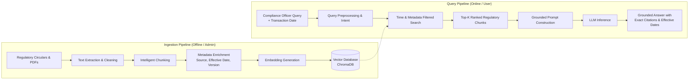

# ChronoLex Architecture Overview

ChronoLex is designed as a time-aware, source-grounded Retrieval-Augmented Generation (RAG) assistant for banking regulatory compliance.

## High-Level Architecture

## Core Architectural Principles

1. **Time-Aware Retrieval**: Banking rules evolve over time. Regulations are amended, superseded, or introduced with specific effective dates. Retrieving an outdated rule or applying a 2026 circular to a 2023 transaction results in severe compliance errors. Metadata tracks `effective_from`, `effective_to`, `supersedes_id`, and `issuing_authority`.
2. **Strict Grounding & Citation**: Every assertion made by the assistant must link directly to an exact document ID, section, and circular paragraph. If sufficient context does not exist, the system must clearly refuse to answer rather than hallucinate.
3. **Modular Monorepo**: Decoupled Python FastAPI backend (`apps/api`) and modern Next.js TypeScript frontend (`apps/web`), sharing clean schemas and contract definitions.
4. **Simple, Transparent Orchestration**: Avoid bulky orchestrator lock-in. Implement transparent, maintainable Python service modules for chunking, embedding, vector retrieval, and prompt injection.
